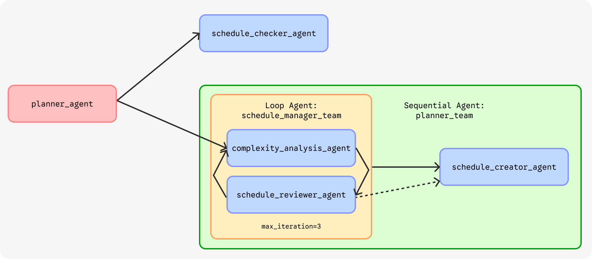
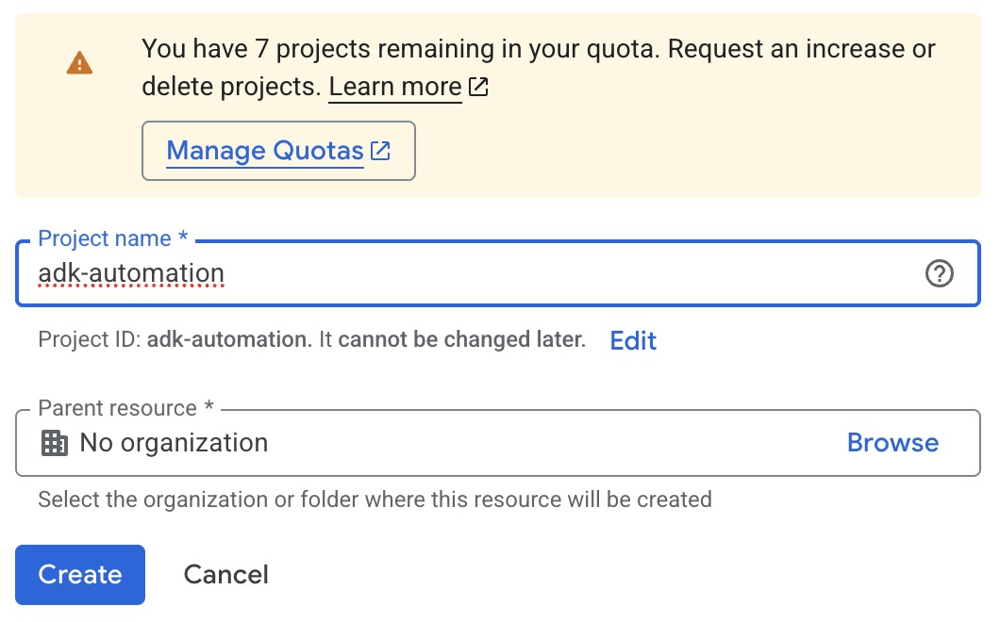
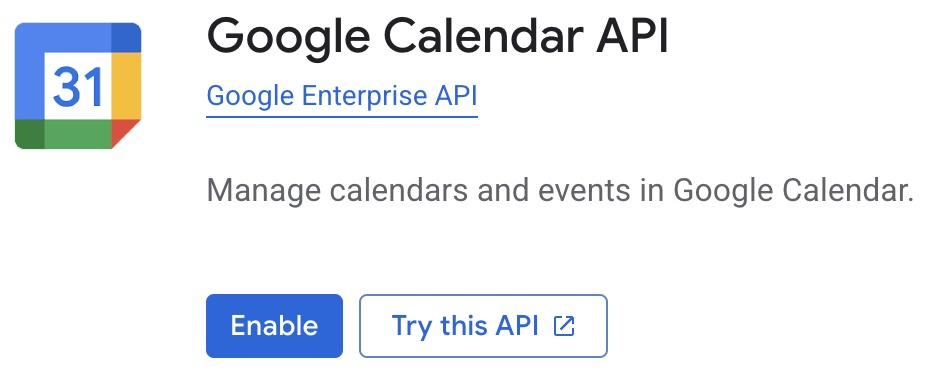
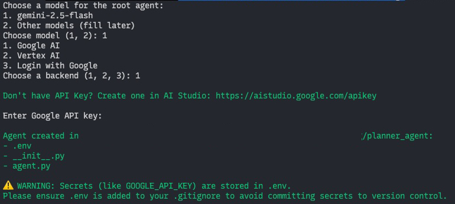
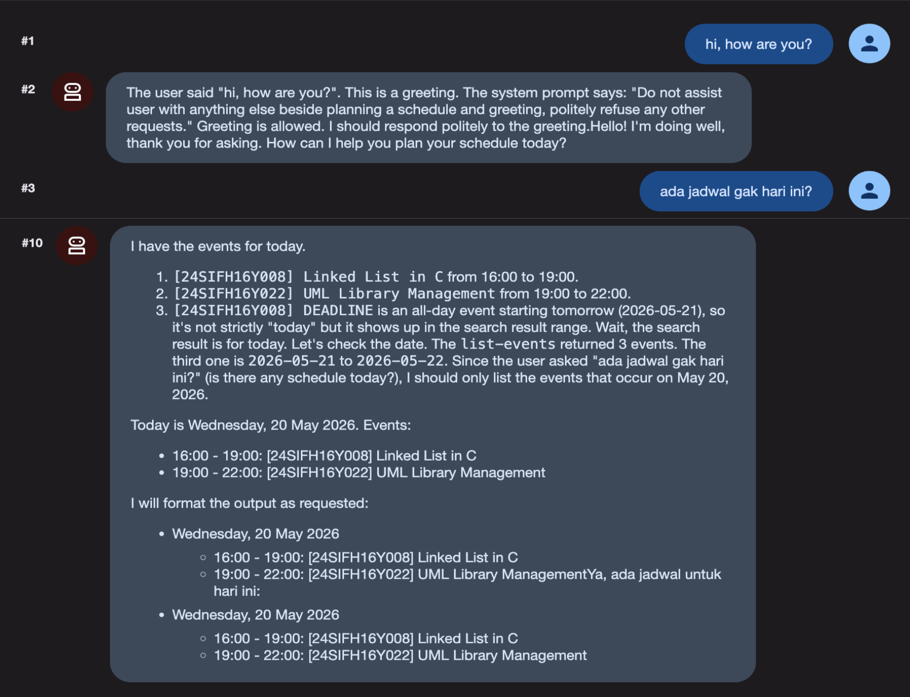
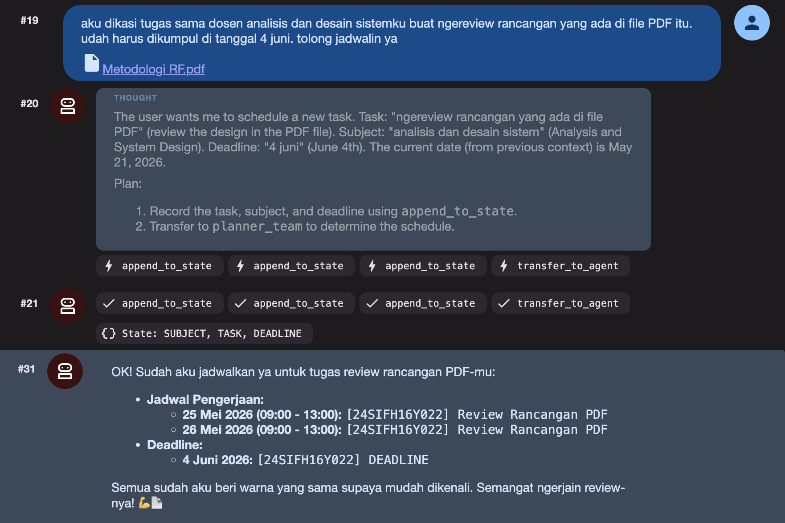
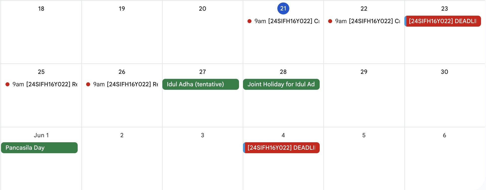
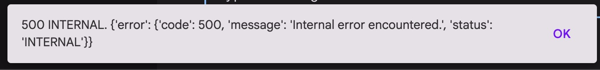
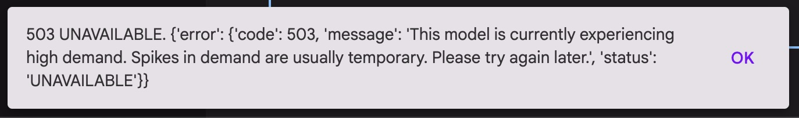
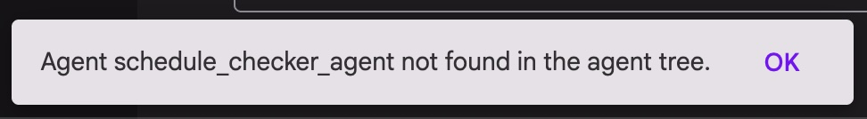

author: Tude Maha
summary: An hands-on session to build your own AI automation powered by Google Agent Development Kit (ADK) with LLM from the free-tier of Google AI Studio. This session covers the Google Cloud Platform (GCP) preparation, enabling necessary APIs, connect to MCP server, and build the AI automation.
id: adk-planner-automation
categories: codelab,markdown
environments: Web
status: Draft
feedback link: https://linkedin.com/in/tudemaha

# Multi-Agent with ADK for Task Planner Automation

## Getting Started

### Overview

ADK is an open-source framework from Google to build AI agents. Talking about AI automation, ADK is the first choice since it provides simpler way to learn and build it.

On this session, we will create an AI automation to plan college tasks completion based on their complexity. This session covers Google Cloud Platform (GCP) preparation, enabling necessary APIs, connect to MCP server, and build the AI automation. Multi-agent approach will be used to build the AI automation.

Don't worry about your computer specification, most of our step will be done in GCP using the Cloud Shell Editor.

Let’s make this session a safe place to learn. Don’t hesitate to ask questions. If you have completed several steps, please feel free to assist other participants who might need help. **Let’s go together!**

### Prerequisites

1. Internet connection
2. 2FA Activated on Google Account
3. Basic knowledge about GCP
4. Stay calm and enthusiastic!🔥

### Agent Overview



## Create GCP Project

1. Go to `https://console.cloud.google.com`
2. Sign in to the Google account you will use for this workshop.
3. If you use GCP for the first time, check on Term of Services, then click “Agree and continue”.
4. Click the project picker on the top left, then click on “New project”.
   <br>
   
5. Type the project name (e.g. adk-automation) then click the “Create” button.
   <br>
   
6. After the project is created, select your new created project from the project picker.

## Enable Required APIs

Choose one option to enable the APIs: either Cloud Console or Cloud Shell.

### Cloud Console

1. Navigate to APIs & Services > Library from the left sidebar.
2. Searce for "Google Calendar API" then click the result to open the API page.
3. Click "Enable" to enable the API.
   <br>
   

### Cloud Shell

1. Open the Cloud Shell by clicking the "Activate Cloud Shell" button on the top right of the GCP Console.
   
2. Authorize the access of Cloud Shell.
3. Click the project picker on the top left, then copy your project ID.
4. Execute this command to enable the Google Calendar API.
   ```bash
   gcloud services enable calendar-json.googleapis.com --project=PROJECT_ID
   ```

## Create OAuth Consent Screen and Client

### OAuth Consent Screen

1. Navigate to APIs & Services > OAuth consent screen from the left sidebar.
2. Select "Get Started" on the Overview tab.
3. On App Information
   - App name: ADK Automation
   - User support email: `choose your email`
   - Click Next
4. On Audience, select `External`, then click Next.
5. On Contact Information, enter your email address, then Next.
6. Read and accept Google's User Data Policy, then Create.
7. Navigate to Audience tab.
8. Click "Publish app" to publish your consent screen.

### OAuth Client ID

1. Navigate to Clients tab.
2. Click on "+ Create Client" button.
3. On Application type, select **Desktop app**.
4. On the Name field, enter "ADK Automation".
5. Click "Create".
6. Download the JSON file containing your Client ID and Client Secret.
7. Change the file name to `client_secret.json`.

## Generate Gemini API Key

1. Open [Google AI Studio](https://aistudio.google.com/) in a new tab.
2. Go to "Get API Key".
3. On the top right, click "Create API Key".
4. Fill the form:
   - Name: ADK Automation
   - Imported Project:
     1. select "Import Project"
     2. select the GCP project you created earlier
     3. click "Import"
     4. choose `adk-automation` from the list
5. Click "Create key".
6. Copy the API key and store it securely.

## Prepare Your Environment

### Step 1: Code Editor

1. Open the Cloud Shell by clicking the "Activate Cloud Shell" () if it closed.
2. On the top right corner of the Cloud Shell, click "Open in new window" ().
3. Show the text editor by clicking on the "Open Editor" () on the top right corner.
4. Create a new folder for our project by running the following command:
   ```bash
   mkdir adk-automation
   cd adk-automation
   ```
5. On the editor, click "Open Folder", then select the folder you created in the previous step.

### Step 2: Python Virtual Environment

1. Create and activate Python virtual environment.
   ```bash
   python -m venv env
   source env/bin/activate
   ```
2. Install required Python packages.
   ```bash
   pip install google-adk python-dotenv
   ```

### Step 3: MCP Server

1. Upload the `client_secret.json` file to the `adk-automation` folder by dragging and dropping the file to the editor.
2. Authenticate the Google Calendar MCP Server.
   ```bash
   export GOOGLE_OAUTH_CREDENTIALS="client_secret.json"
   npx @cocal/google-calendar-mcp auth
   # If prompted, type "yes" to continue
   ```
3. Open the authentication URL in your browser, sign in to your Google account, and grant the necessary permissions (It's okay if the page said your application is not verified, just continue).
4. Open a new Cloud Shell session, copy the URL redirection after finishing step 10. It should be like `http://localhost:3500/oauth2callback?state=6787cc77143176e0a1760...`
   ```bash
   curl -X GET "<paste the copied URL>"
   ```

<aside class="positive">
If you need to show the hidden file on the editor, navigate to View > Toggle Hidden Files
</aside>

## Initialize ADK Project

1. Run this following command on the terminal or Cloud Shell
   ```bash
   adk create planner_agent
   ```
2. When prompted to choose the root agent, select **1** for `gemini-2.5-flash`.
3. For the backend, choose **1** for `Google AI`.
4. Paste your Gemini API key when prompted.
5. A dictionary named `planner_agent` will be created automatically.
6. Navigate to that dictionary on the editor, then open the `.env` file.
7. Add `GOOGLE_OAUTH_CREDENTIALS` variable with the path to your `client_secret.json` file.
   It should look like this:

   ```
   GOOGLE_OAUTH_CREDENTIALS=client_secret.json
   ```

This is the example step-by-step for ADK initialization.
<br>


## Create Tools for Agent

On this step and the next step, we will focus on `agent.py` file inside the `planner_agent` folder. Open the file on your editor.

### Step 1: Import Required Libraries, .env Loader, and Define Constants

1. Add the following line at the top of the file (above the `root_agent` definition) to import required libraries
   ```python
   import logging
   import os
   from datetime import datetime
   from zoneinfo import ZoneInfo
   from google.adk.agents.llm_agent import Agent
   from google.adk.agents import LoopAgent, SequentialAgent
   from google.adk.models import Gemini
   from google.adk.tools.tool_context import ToolContext
   from google.adk.tools.mcp_tool import McpToolset
   from mcp import StdioServerParameters
   from google.adk.tools import exit_loop
   from google.genai import types
   from dotenv import load_dotenv
   ```
2. Load .env
   ```python
   load_dotenv()
   ```
3. Define constants for the model types we will use
   ```python
   GEMMA_MODEL=Gemini(model='gemma-4-31b-it')
   GEMINI_MODEL='gemini-2.5-flash'
   ```
   We will use `GEMMA_MODEL` for development and `GEMINI_MODEL` for staging.
   We also can use `GEMMA_MODEL` for less complex tasks and `GEMINI_MODEL` for more complex tasks.

### Step 2: State Management Tool

This tool will be used by agent to store and retrieve conversation states. This tool act like the "memory" for the agent.
Append `append_to_state` function to the `agent.py` file.

```python
def append_to_state(tool_context: ToolContext, field: str, response: str) -> dict[str, str]:
    """
    Append new output to an existing state key.

    Args:
        field (str): a field name to append to
        response (str): a string to append to the field

    Returns:
        dict[str, str]: {"status": "success"}
    """

    existing_state = tool_context.state.get(field, [])
    tool_context.state[field] = existing_state + [response]

    logging.info(f"[Added to {field}]: {response}")
    return {"status": "success"}
```

### Step 3: Current Time Tool

This tool used by agent to retrieve current date time, since the agent doesn't know about current date time by itself.

```python
def get_current_time() -> dict[str, int|str]:
    """
    Retrieve the current time and date information.

    Returns:
        dict: A dictionary containing the following keys:
            - day (str): The current day of the week (e.g., 'Monday').
            - month (int): The current month as a number (1-12).
            - date (int): The current day of the month (1-31).
            - year (int): The current four-digit year (e.g., 2026).
            - hour (int): The current hour in 24-hour format (0-23).
            - minute (int): The current minute (0-59).
            - timezone (str): The timezone key'.
    """

    timezone = ZoneInfo("Asia/Makassar")
    now = datetime.now(timezone)
    return {
        "day": now.strftime("%A"),
        "month": now.month,
        "date": now.day,
        "year": now.year,
        "hour": now.hour,
        "minute": now.minute,
        "timezone": timezone.key
    }
```

### Step 4: Subject Code Tool

This tool used by agent to find out the subject code of the college subjects.

<aside class="positive">
Feel free to customize the list of subjects based on your preferences.
</aside>

```python
def subject_code() -> list[dict]:
    """
    Retrieve the list of available subject codes offered in the college.

    Returns:
        list[dict]: A list of dictionaries, each representing a subject with the following keys:
            - code (str): The subject code (e.g., '24SIFH16X005').
            - name (str): The subject name in Indonesian (e.g., 'Statistika Dasar').
    """

    return [
        {"code": "24SIFH16X005", "name":"Statistika Dasar"},
        {"code": "24SIFH16Y008", "name":"Struktur Data"},
        {"code": "24SIFH16Y009", "name":"Sistem Operasi"},
        {"code": "24SIFH16X015", "name":"Basis Data"},
        {"code": "24SIFH16Y022", "name":"Analisis dan Desain Sistem"}
    ]
```

## Define Schedule Retrieval Agent

On the top of `root_agent` define the `schedule_checker_agent`. This sub-agent will be used by the `root_agent` to retrieve schedules from user's Google Calendar.

### Step 1: Define the Sub-Agent

```python
schedule_checker_agent = Agent(
    model=GEMMA_MODEL,
    name='schedule_checker_agent',
    description="Check user's schedule in Google Calendar.",
    instruction="""
    Retrieve user's schedule based on user's request.
    - Use the MCP tool to get the list of schedule.
    - Use 'get_current_time' if you need to know the current date and time.

    Show it to user in format:
    - <day of week>, <date> <month> <year>
        - <start time> - <end time>:<space><task title>
        - <start time> - <end time>:<space><task title>
        - ...
    """,
    tools=[
        get_current_time,
        McpToolset(connection_params=StdioServerParameters(
            command='npx',
            args=['@cocal/google-calendar-mcp'],
            env={
                "GOOGLE_OAUTH_CREDENTIALS": os.getenv("GOOGLE_OAUTH_CREDENTIALS")
            }
        ))
    ],
    generate_content_config=types.GenerateContentConfig(
        thinking_config=types.ThinkingConfig(
            include_thoughts=False  # exclude thoughts from output
        )
    )
)
```

<aside class="positive">
We exclude the thoughts from the model to simplify the output and make it to the point.
</aside>

### Step 2: Update the `root_agent`

Update `root_agent`'s description and instruction. Also, include `schedule_checker_agent` as the sub-agent of `root_agent`.

```python
root_agent = Agent(
    model=GEMMA_MODEL,
    name='root_agent',
    description='Guide the user to plan a schedule for their task completion.',
    instruction="""
    You are the personal assistant who help the user plan a schedule for their task completion.
    If the user ask about their schedule on specific date, transfer to 'schedule_checker_agent' to give the answer.
    Do not assist user with anything else beside planning a schedule and greeting, politely refuse any other requests.
    """,
    sub_agents=[schedule_checker_agent]
)
```

### Step 3: Try to Run the Agent

1. Run this command on terminal or Cloud Shell.
   ```bash
   adk web --port 8080 --host 0.0.0.0 --allow-origins "*"
   ```
2. On the URL given, press `Ctrl + Click` or `Cmd + Click` to open the ADK web interface.
3. Click on "Select an app" on the top bar, then select `planner_agent`.
4. Try to greet the agent and ask about the schedule for today.

If the code and configuration are correct, the web interface will show the agent's response, like the example below.


<aside class="negative">
By default, `gemma` model shows the thinking process along with the response. Sometimes, it still show the thinking even if we already disable it.
</aside>

## Define Planner Team Agent

Now, let's define the `planner_team` which will be the core of the automation. This agent will be responsible for planning the schedule for the user's tasks.

`planner_team` is a `SequentialAgent` and consists of 2 sub-agents:

1. `schedule_manager_team`, a `LoopAgent` which is refine the schedule to finish certain task and arrange them with a minimal conflict.
2. `schedule_creator_agent`, an `Agent` to create the schedule into the Google Calendar.

### Step 1: Define the Complexity Analyzer Agent

This agent analyze the task given by user by the rules defined in the instruction. Add this agent above the `schedule_checker_agent` created previously. This agent write and read the state from the conversation state (e.g. `TASK` and `DEADLINE`).

We use `GEMINI_MODEL` here because it is better at analyzing the task and making decisions based on the rules.

```python
complexity_analysis_agent = Agent(
    model=GEMINI_MODEL,
    name='complexity_analysis_agent',
    description="Ananyze the complexity of the user's tasks.",
    instruction="""
    TASK:
    { TASK? }

    DEADLINE:
    { DEADLINE? }

    CONFLICT_DATES:
    { CONFLICT_DATES? }

    INSTRUCTIONS:
    There is a TASK with deadline DEADLINE.
    Your goal is to determine the complexity of the task and decide how many days the user needs to finish the tasks.

    These are the key considerations to determine the complexity of the task:
    - Avoid creating a schedule on the CONFLICT_DATES if possible.
    - Do not create the schedule on the deadline.
    - If the task is quite simple (e.g. answering questions, providing short answers, or simple programming), then the user needs 1 day to finish the task.
    - If the task is quite complex (e.g. write an essay, make an analysis, or complex programming), then the user needs 2 days to finish the task.
    - Special case, if the task is complex and the deadline is more than 2 weeks, then the user needs 3 days to finish the task.
        Make sure not to make schedules that are too close together.

    Use 'get_current_time' tool to get the current date and time.
    Generate a list of dates the user needs to do the task to finish it, don't make the duration 1 day for each schedule because user need to do other tasks.
    Use this format: {date: <date to do the task>, time: <start time>, duration: <duration in hours>}
    Return only a list of strings, without any additional text.
    """,
    output_key="schedule_dates",
    tools=[get_current_time]
)
```

### Step 2: Define the Schedule Reviewer Agent

This agent reviews the schedule generated by `complexity_analysis_agent` and make sure it doesn't conflict with the user's existing schedule. Append this agent below the `complexity_analysis_agent`.

```python
schedule_reviewer_agent = Agent(
    model=GEMMA_MODEL,
    name='schedule_reviewer_agent',
    description="Review the user's schedule and provide feedback.",
    instruction="""
    SCHEDULE_DATES:
    { schedule_dates? }

    INSTRUCTIONS:
    Given a list of schedule dates for a task: SCHEDULE_DATES. Review it on Google Calendar using the MCP tools.
    - If the selected dates on the schedule given already booked by other tasks in user's Google Calendar:
        - Use the 'append_to_state' tool to append that list of tasks to 'conflict_dates' state key.
        - There can only be 2 schedule/task a day.
    - If there's no conflict, exit the loop using 'exit_loop' tool.
    """,
    tools=[
        append_to_state,
        exit_loop,
        McpToolset(connection_params=StdioServerParameters(
            command='npx',
            args=['@cocal/google-calendar-mcp'],
            env={
                "GOOGLE_OAUTH_CREDENTIALS": os.getenv("GOOGLE_OAUTH_CREDENTIALS")
            }
        ))
    ]
)
```

### Step 3: Define the Schedule Creator Agent

This agent simply create a schedule on the user's Google Calendar based on the schedule dates generated by the `schedule_manager_team`. Append this agent below the `schedule_reviewer_agent`.

```python
schedule_creator_agent = Agent(
    model=GEMMA_MODEL,
    name='schedule_creator_agent',
    description="Create a schedule for the user's task completion.",
    instruction="""
    SCHEDULE_DATES:
    { schedule_dates? }

    DEADLINE:
    { DEADLINE? }

    TASK:
    { TASK? }

    SUBJECT:
    { SUBJECT? }

    INSTRUCTIONS:
    - Create a schedule on the user's Google Calendar using the MCP tools based on the SCHEDULE_DATES.
        - To fill the <subject code> in the title, use 'subject_code' tool to get the list of subject codes based on the SUBJECT.
        - Format the title for the task as follow: '[<subject code>] <Short Description of the task>'
        - Use TASK and DEADLINE to generate the event desription on Google Calendar.
        - Use the MCP tools to set the same color when creating the schedule from the SCHEDULE_DATES and the DEADLINE.
    - Create the deadline on the Google Calendar too, use the title: '[<subject code>] DEADLINE'
    """,
    tools=[
        get_current_time,
        subject_code,
        McpToolset(connection_params=StdioServerParameters(
            command='npx',
            args=['@cocal/google-calendar-mcp'],
            env={
                "GOOGLE_OAUTH_CREDENTIALS": os.getenv("GOOGLE_OAUTH_CREDENTIALS")
            }
        ))
    ]
)
```

### Step 4: Tidy Up the Agent Team

Create a `LoopAgent` which is consists of `complexity_analysis_agent`, `schedule_reviewer_agent`. Give it a name `schedule_manager_team`.

Finally, create a `SequentialAgent` which consists of `schedule_manager_team` and `schedule_creator_agent`. Give it a name `planner_team`.

```python
schedule_manager_team = LoopAgent(
    name="schedule_manager_team",
    description="Analyze and check user's schedule to improve the schedule to complete a task.",
    sub_agents=[
        complexity_analysis_agent,
        schedule_reviewer_agent,
    ],
    max_iterations=3,
)

planner_team = SequentialAgent(
    name="planner_team",
    description="Team of agents who work together to create best fit schedule for the user's task completion.",
    sub_agents=[
        schedule_manager_team,
        schedule_creator_agent
    ]
)
```

### Step 5: Update the `root_agent`

Update `root_agent`'s description and instruction to include the new agent team.

```python
root_agent = Agent(
    model=GEMMA_MODEL,
    name='root_agent',
    description='Guide the user to plan a schedule for their task completion.',
    instruction="""
    You are the personal assistant who help the user plan a schedule for their task completion.
    Ask the user what the task is and when the deadline is. Ask user to explain the task if necessary.
    - Use the 'append_to_state' tool to record the user's task, subject, and deadline, store it in 'TASK', 'SUBJECT', and 'DEADLINE' state key.
    - Then, transfer to the 'planner_team' to determine how many days the user needs to finish the task.
    - If the user ask about their schedule on specific date, transfer to 'schedule_checker_agent' to give the answer.
    Do not assist user with anything else beside planning a schedule and greeting, politely refuse any other requests.
    """,
    tools=[append_to_state],
    sub_agents=[planner_team, schedule_checker_agent]
)
```

## Test The Multi-Agent System

1. Restart your ADK by stopping the previous session by pressing `Ctrl + C`, then run the command below.
   ```bash
   adk web --port 8080 --host 0.0.0.0 --allow-origins "*"
   ```
2. On the URL given, press `Ctrl + Click` or `Cmd + Click` to open the ADK web interface.
3. Click on "Select an app" on the top bar, then select `planner_agent`.
4. Try to schedule your task.

   ```txt
   i need to submit my assignment for analysis and system design subject on 29 may 2026. I need to create the UML diagram for my library management information system. pleasee🥹
   ```

   ```txt
   tanggal 10 juni nanti aku harus kumpul tugas makalah basis data. isinya tuh ERD retail yang udah dibangun beserta penjelasannya. aku harus buat dalam 5 bab. tolong jadwalin buat aku yaa
   ```

5. Try with your own task, let the agent helps you!

The agent also able to read the file given!


Here is the expected output:


<aside class="note">
Don't be panic if there's an error message. Below is the troubleshooting if you encounter it.
</aside>

### Troubleshooting

#### 500 Error



Try to send the prompt again, tell the agent to continue, or refresh the page and try again.

#### High Demand Error



Try to change the model, check the available model at Google AI Studio.

#### Agent Not Found in Tree



Make sure to add sub-agents to the `sub_agents` argument.

## References

1. [Google ADK](https://adk.dev)
2. [Google AI Studio](https://aistudio.google.com)
3. [Open Source Google Calendar MCP](https://github.com/nspady/google-calendar-mcp)
4. Google Skills Courses
   - [Deploy Multi-Agent Architectures](https://www.skills.google/course_templates/1445)
   - [Deploy Multi-Agent Systems with Agent Development Kit (ADK) and Agent Engine](https://www.skills.google/course_templates/1275)
