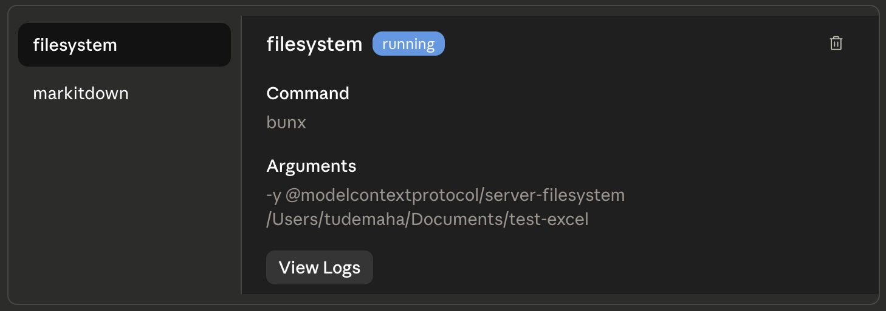
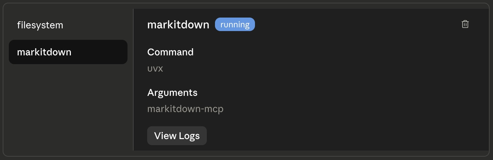
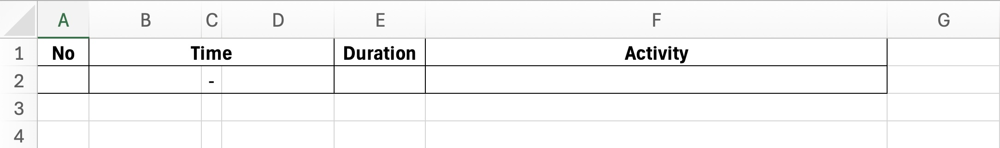
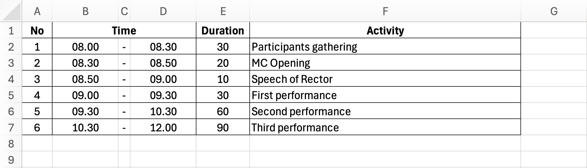

author: Tude Maha
summary: Hands-on session for "Renew Your Office Workflow with AI Companion" workshop. This session includes the Claude Desktop preparation and its MCP connection, followed by a simple raw data analysis from Microsoft Excel file. Microsoft Excel will be used to manipulate the data with the companion of Claude. Lastly, we will use Claude to guide us to build a report based on the data in Microsoft Word.
id: ai-companion-office
categories: codelab,markdown
environments: Web
status: Draft
feedback link: https://linkedin.com/in/tudemaha

# Renew Your Office Workflow with AI Companion: Let’s Collaborate Claude, Excel, and Word

## Getting Started

### Overview

AI usage enable us to have a fast productivity boost. By using AI, we can renew our Office workflow using the help of AI Companion. Claude is the main AI model/platform will be used in this session.

Claude, especially Claude Desktop has the ability to connect to MCP servers. This allows Claude to access our Excel file without the need to upload it manually. This also allow us to connect to various MCP servers.

Let’s make this session a safe place to learn. Don’t hesitate to ask questions. If you have completed several steps, please feel free to assist other participants who might need help.

### Prerequisites

1. Internet connection
2. Microsoft Office 2016 or above, or Microsoft Office 365
3. [Claude Desktop](https://claude.com/download) installed
4. [Claude account](https://claude.ai/login)
5. [Bun](https://bun.sh/) and [uv](https://docs.astral.sh/uv/#installation) installed to start MCP server
6. Stay calm and enthusiastic!🔥

## MCP Connection

### Bun Installation

Follow instructions below based on your operating system.

#### macOS

1. Open Terminal
2. Run the following command:
   ```bash
   curl -fsSL https://bun.sh/install | bash
   ```
3. Close and reopen Terminal
4. Type `bun --version` to verify that Bun was installed successfully

#### Windows

1. Open Terminal or PowerShell
2. Run the following command:
   ```powershell
   powershell -c "irm bun.sh/install.ps1 | iex"
   ```
3. Close and reopen Terminal or PowerShell
4. Type `bun --version` to verify that Bun was installed successfully

### uv Installation

Follow instructions below based on your operating system.

#### macOS

1. Open Terminal
2. Run the following command:
   ```bash
   curl -LsSf https://astral.sh/uv/install.sh | sh
   ```
3. Close and reopen Terminal
4. Type `uv --version` to verify that Bun was installed successfully

#### Windows

1. Open Terminal or PowerShell
2. Run the following command:
   ```powershell
   powershell -ExecutionPolicy ByPass -c "irm https://astral.sh/uv/install.ps1 | iex"
   ```
3. Close and reopen Terminal or PowerShell
4. Type `uv --version` to verify that Bun was installed successfully

### Create a Working Directory

1. Go to Finder or File Explorer, then create a folder. This folder will be your main working folder for this session.
2. Copy your path to the folder and store in a text editor to be used for the next step.
<aside class="positive">
Your absolute file path might looks like `/Users/tudemaha/Documents/excel-project` for macOS or `C:\Users\tudemaha\Documents\excel-project` for Windows.
</aside>

### Connect MCP Servers to Claude Desktop

1. Open Claue Desktop
2. Click on the profile icon on the bottom left
3. Select "Settings"
4. Go to "Developer" tab
5. Click on "Edit Config" button
6. Open the `claude_desktop_config.json` file on the text editor (Notepad, TextEdit, or VS Code)
7. Insert the following code at the beginning of the JSON file:
   ```json
   {
     "mcpServers": {
       "filesystem": {
         "command": "bunx",
         "args": [
           "-y",
           "@modelcontextprotocol/server-filesystem",
           "<your_working_directory_path>"
         ]
       },
       "markitdown": {
         "command": "uvx",
         "args": ["markitdown-mcp"]
       }
     },
     "... other existing settings ..."
   }
   ```
8. Save the file and close the text editor
9. Restart Claude Desktop for the changes to take effect
10. Repeat step 1 to 4, make sure the `filesystem` and `markitdown` MCP connection running.
    
    

## Warm Up with Microsoft Excel

In this section, we will create a dynamic schedule table for an event rundown. By using this table, we only need to know the event's start time and duration for each activity. The table will automatically calculate the end time for each activity.

1. Create an Excel file, let's name it `rundown.xlsx`, and save it in your working directory.
2. Create a table with this headers: "No", "Time", "Duration", and "Activity" following the example below.
   
3. At cell **B2**, enter the starting time of the event, for example `08:00`.
4. At cell **D2**, enter a formula `=B2+TIME(0;E2;0)` where `E2` is the duration of the activity in minutes.
5. Enter the duration of the first activity in minutes at cell **E2**, for example `30`. Cell D2 will automatically show the end time of the activity.
6. At cell **B3**, enter a formula `=D2`, it will be the starting time for the second activity.
7. At cell **D3**, we will use the same formula as on step 4, but on different cell reference, so it will be `=B3+TIME(0;E3;0)`.
8. Enter the duration of the second activity in minutes at cell **E3**, for example `45`.
9. Repeat step 6 to 8 to fill in the rest of the table with adjustment of the reference cell, or you can block range `B3:D3`, drag the fill handle to the bottom right of the last cell in the range, then release the mouse button. The formula will automatically adjust the reference cell.
10. Now you have a dynamic rundown table, you can change the start time or duration of any activity and the table will automatically update.
11. Use the "Format Painter" tool to copy the format of the first row to the rest of the rows.

After finishing the steps, you will have this dynamic rundown table.


## The Main Quest
