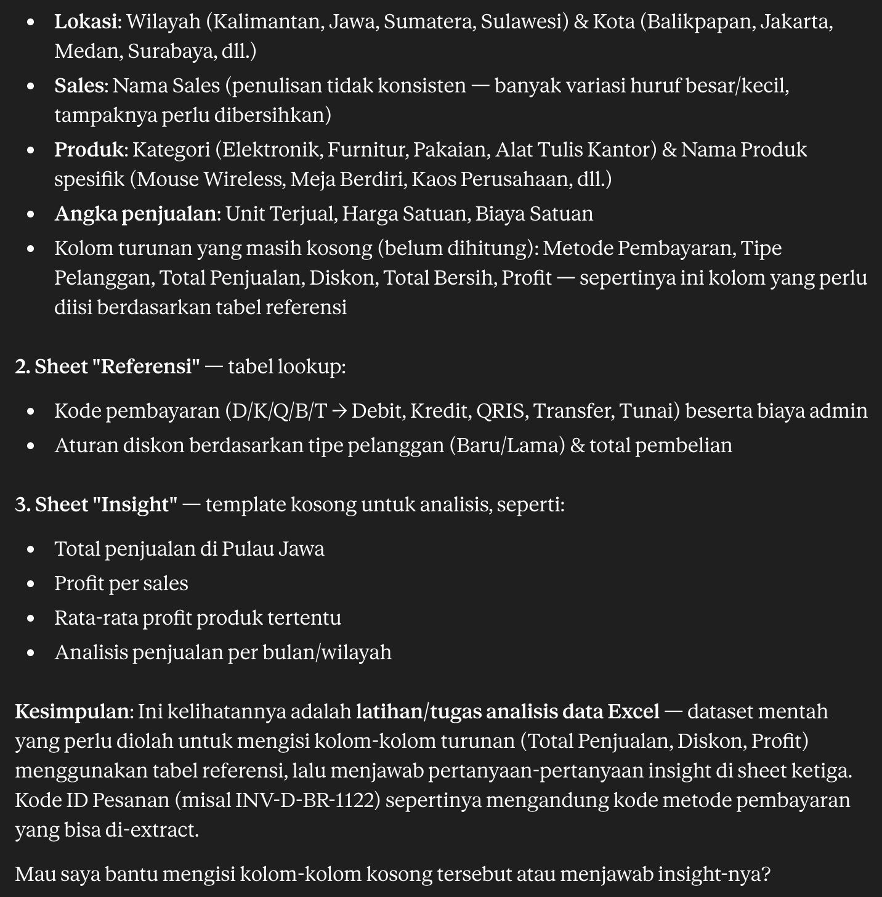
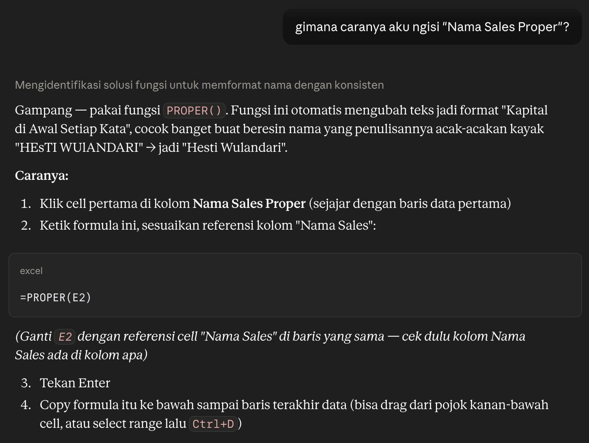
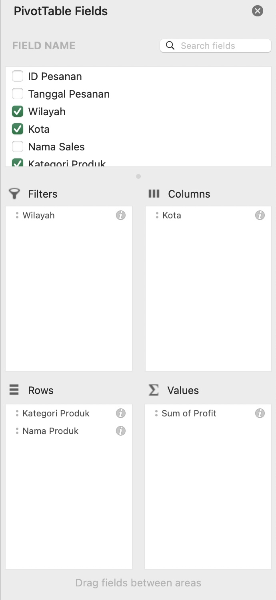
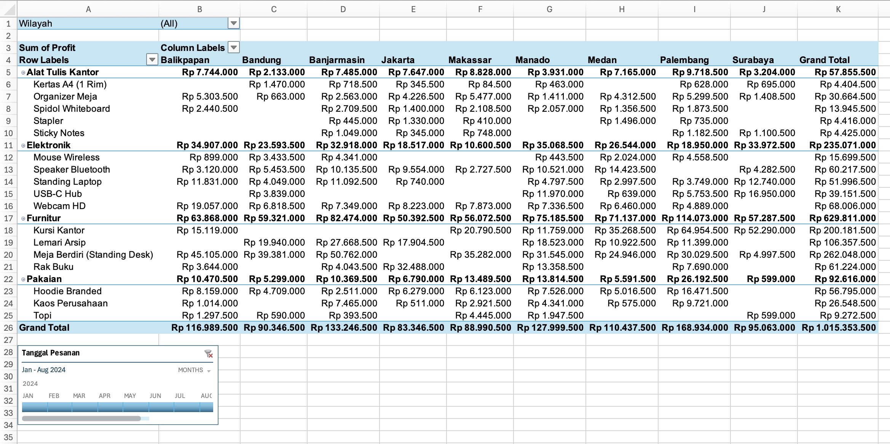
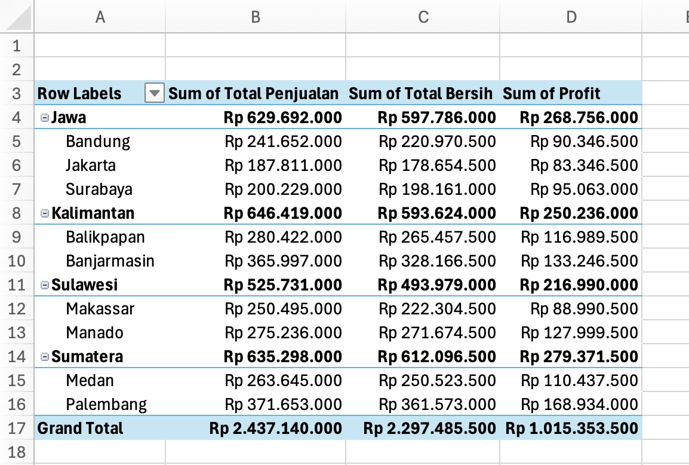
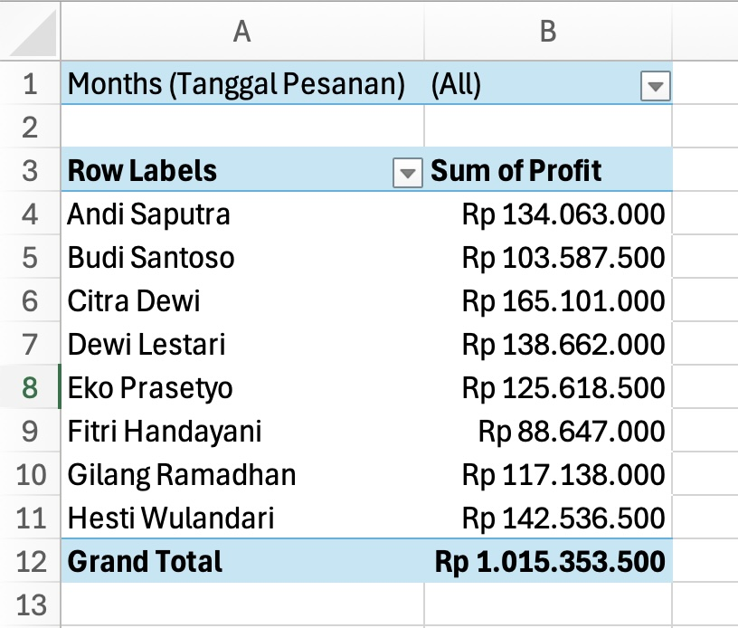

author: Tude Maha
summary: Hands-on session for "Renew Your Office Workflow with AI Companion" workshop. This session includes the Claude Desktop preparation and its MCP connection, followed by a simple raw data analysis from Microsoft Excel file. Microsoft Excel will be used to manipulate the data with the companion of Claude. Lastly, we will use Claude to guide us to build a report based on the data in Microsoft Word.
id: ai-companion-office
categories: codelab,markdown
environments: Web
status: Draft
feedback link: https://linkedin.com/in/tudemaha

# Renew Your Office Workflow with AI Companion: Let’s Collaborate Claude, Excel, and Word

## Getting Started

### Overview

AI usage enable us to have a fast productivity boost. By using AI, we can renew our Office workflow using the help of AI Companion. Claude is the main AI model/platform will be used in this session.

Claude, especially Claude Desktop has the ability to connect to MCP servers. This allows Claude to access our Excel file without the need to upload it manually. This also allow us to connect to various MCP servers.

Let’s make this session a safe place to learn. Don’t hesitate to ask questions. If you have completed several steps, please feel free to assist other participants who might need help.

### Prerequisites

1. Internet connection
2. Microsoft Office 2016 or above, or Microsoft Office 365
3. [Claude Desktop](https://claude.com/download) installed
4. [Claude account](https://claude.ai/login)
5. [Bun](https://bun.sh/) and [uv](https://docs.astral.sh/uv/#installation) installed to start MCP server
6. Stay calm and enthusiastic!🔥

## MCP Connection

### Bun Installation

Follow instructions below based on your operating system.

#### macOS

1. Open Terminal
2. Run the following command:
   ```bash
   curl -fsSL https://bun.sh/install | bash
   ```
3. Close and reopen Terminal
4. Type `bun --version` to verify that Bun was installed successfully

#### Windows

1. Open Terminal or PowerShell
2. Run the following command:
   ```powershell
   powershell -c "irm bun.sh/install.ps1 | iex"
   ```
3. Close and reopen Terminal or PowerShell
4. Type `bun --version` to verify that Bun was installed successfully

### uv Installation

Follow instructions below based on your operating system.

#### macOS

1. Open Terminal
2. Run the following command:
   ```bash
   curl -LsSf https://astral.sh/uv/install.sh | sh
   ```
3. Close and reopen Terminal
4. Type `uv --version` to verify that Bun was installed successfully

#### Windows

1. Open Terminal or PowerShell
2. Run the following command:
   ```powershell
   powershell -ExecutionPolicy ByPass -c "irm https://astral.sh/uv/install.ps1 | iex"
   ```
3. Close and reopen Terminal or PowerShell
4. Type `uv --version` to verify that Bun was installed successfully

### Create a Working Directory

1. Go to Finder or File Explorer, then create a folder. This folder will be your main working folder for this session.
2. Copy your path to the folder and store in a text editor to be used for the next step.
<aside class="positive">
Your absolute file path might looks like `/Users/tudemaha/Documents/excel-project` for macOS or `C:\Users\tudemaha\Documents\excel-project` for Windows.
</aside>

### Connect MCP Servers to Claude Desktop

1. Open Claue Desktop
2. Click on the profile icon on the bottom left
3. Select "Settings"
4. Go to "Developer" tab
5. Click on "Edit Config" button
6. Open the `claude_desktop_config.json` file on the text editor (Notepad, TextEdit, or VS Code)
7. Insert the following code at the beginning of the JSON file:
   ```json
   {
     "mcpServers": {
       "filesystem": {
         "command": "bunx",
         "args": [
           "-y",
           "@modelcontextprotocol/server-filesystem",
           "<your_working_directory_path>"
         ]
       },
       "markitdown": {
         "command": "uvx",
         "args": ["markitdown-mcp"]
       }
     },
     "... other existing settings ..."
   }
   ```
8. Save the file and close the text editor
9. Restart Claude Desktop for the changes to take effect
10. Repeat step 1 to 4, make sure the `filesystem` and `markitdown` MCP connection running.
    
    

<!-- ## Warm Up with Microsoft Excel

In this section, we will create a dynamic schedule table for an event rundown. By using this table, we only need to know the event's start time and duration for each activity. The table will automatically calculate the end time for each activity.

If you want, download [this Excel file](https://tudemaha.my.id/files/dynamic-rundown.xlsx) then move it to your working directory to make it easier to follow.

1. Create an Excel file, let's name it `rundown.xlsx`, and save it in your working directory.
2. Create a table with this headers: "No", "Time", "Duration", and "Activity" following the example below.
   
3. At cell **B2**, enter the starting time of the event, for example `08:00`.
4. At cell **D2**, enter a formula `=B2+TIME(0;E2;0)` where `E2` is the duration of the activity in minutes.
5. Enter the duration of the first activity in minutes at cell **E2**, for example `30`. Cell D2 will automatically show the end time of the activity.
6. At cell **B3**, enter a formula `=D2`, it will be the starting time for the second activity.
7. At cell **D3**, we will use the same formula as on step 4, but on different cell reference, so it will be `=B3+TIME(0;E3;0)`.
8. Enter the duration of the second activity in minutes at cell **E3**, for example `45`.
9. Repeat step 6 to 8 to fill in the rest of the table with adjustment of the reference cell, or you can block range `B3:D3`, drag the fill handle to the bottom right of the last cell in the range, then release the mouse button. The formula will automatically adjust the reference cell.
10. Now you have a dynamic rundown table, you can change the start time or duration of any activity and the table will automatically update.
11. Use the "Format Painter" tool to copy the format of the first row to the rest of the rows.

After finishing the steps, you will have this dynamic rundown table.
 -->

## Trying Claude X Excel

Download [this Excel file](https://tudemaha.my.id/files/dataset-penjualan.xlsx) then move it to your working directory.

1. Open Claude Desktop
2. Try to ask this question
   ```text
   Read "dataset-penjualan.xlsx" using `filesystem` MCP tool, then use `markitdown` MCP tool to convert the file into markdown for efficien reading, if needed. Then, tell me, what is the dataset about?
   ```
   ```text
   Baca "dataset-penjualan.xlsx" pakai MCP `filesystem`, terus pakai MCP `markitdown` but konversi file itu jadi markdown biar bacanya lebih efisien, kalau perlu. Terus, kasi tau aku, tentang apa dataset itu?
   ```
3. Click "Allow once" or "Always allow" if needed.
4. Claude will read the file and convert it into markdown, then tell you what the dataset is about.
   
5. Now, try to ask on how to fill the "Nama Sales Proper" to Claude. It will give you the answer.
   

<aside class="negative">
Be wise while using free plan of Claude. Just ask needed questions to avoid unnecessary token consumption. Claude’s free tier limits users to approximately 15 to 40 messages per 5-hour window
</aside>

## Finish the Dataset

1. At cell **K2**, enter a formula `=PROPER(E2)` where `E2` is the "broken" name format, as Claude said.
2. `Metode Pembayaran` column should be filled with the payment method from the reference table. The fifth letter of the `ID Pesanan` is the payment code. Use this formula referenceto fill cell **L2**:
   ```text
   =VLOOKUP(MID(A2;5;1);Referensi!$A$1:$C$6;2;FALSE)
   ```
3. `Tipe Pelanggan` column should be filled with `Lama` or `Baru` based on the seventh and eighth letters of the `ID Pesanan`. BR is Baru and LM is Lama. Use this formula reference to fill cell **M2**:
   ```text
   =IF(MID(A2;7;2)="BR";"Baru";"Lama")
   ```
4. `Total Penjualan` is a multiplication of `Unit Terjual` and `Harga Satuan` column. Use this formula reference to fill cell **N2**:
   ```text
   =I2*H2
   ```
5. Column `Diskon (%)` must be filled in carefully. Look at the reference table, there is the rule to give discount for each purchase. Understand the reference table or ask Claude on how to fill this column. Formula reference to fill cell **O2**:
   ```text
   =IF(AND(M2="BARU";N2>50000000);20%;IF(AND(M2="LAMA";N2>50000000);15%;IF(AND(M2="BARU";N2>20000000);10%;0%)))
   ```
6. `Harga Setelah Diskon` is `Total Penjualan` minus discount amount. Formula reference to fill cell **P2**:
   ```text
   =N2-O2*N2
   ```
7. `Total Bersih` is `Harga Setelah Diskon` minus the admin fee. The fifth letter of the `ID Pesanan` is the payment code. Use VLOOKUP to the reference table to get the admin fee. Formula reference to fill cell **Q2**:
   ```text
   =P2-VLOOKUP(MID(A2;5;1);Referensi!$A$1:$C$6;3;FALSE)
   ```
8. `Profit` is obtained by subtracting the `Total Bersih` from the `Biaya Satuan` tiap `Unit Terjual`. Formula reference to fill cell **R2**:
   ```text
   =Q2-(H2*J2)
   ```
9. To fill all the rows, block range **K2:R2**, drag the fill handle to the bottom right of the last cell in the range, then release the mouse button. The formula will automatically adjust the reference cell.
10. `Total` row is the sum of `Total Bersih` and `Profit`. Formula reference to fill **Q222 and R222**:
    ```text
    =SUM(Q2:Q221)
    =SUM(R2:R221)
    ```
11. `Rata-rata` row is the averate of `Total Bersih` and `Profit`. Formula reference to fill **Q223 and R223**:
    ```text
    =AVERAGE(Q2:Q221)
    =AVERAGE(R2:R221)
    ```
12. Use MAX function to get the maximum of `Total Bersih` and `Profit`. Formula reference to fill **Q224 and R224**:
    ```text
    =MAX(Q2:Q221)
    =MAX(R2:R221)
    ```
13. Use MIN function to get the minimum of `Total Bersih` and `Profit`. Formula reference to fill **Q225 and R225**:
    ```text
    =MIN(Q2:Q221)
    =MIN(R2:R221)
    ```

<aside class="positive">
Pro tip: press F4 or fn + F4 to "lock" the reference table. This is useful while editing a formula to cycle through absolute and relative references (e.g., `A1` → `$A$1` → `$A1` → `A$1`).
</aside>
```

## Get the Insights

Jump to "Insight" sheet. We will answer the questions based on our finished dataset.

1. To get the total sales in Java, we can use `SUMIF` function on `Total Bersih` column based on the `Wilayah` column. Formula reference to fill cell **B1**:
   ```text
   =SUMIF('Data Penjualan'!C2:C221;"JAWA";'Data Penjualan'!N2:N221)
   ```
2. To count the sales in Kalimantan, we can use `COUNTIF` function on `Wilayah` column. Formula reference to fill the cell **B2**:
   ```text
   =COUNTIF('Data Penjualan'!$C$2:$C$221;"KALIMANTAN")
   ```
3. To know the sales profit at Surabaya, we need to sum all the profit in Surabaya city. Use `SUMIF` for this purpose. Formula reference to fill the cell **B3**:
   ```text
   =SUMIF('Data Penjualan'!$D$2:$D$221;"SURABAYA";'Data Penjualan'!$R$2:$R$221)
   ```
4. We need to add up all the USB-C Hub units sold to get the number of units sold. Use `SUMIF` function for this purpose. Formula reference to fill the cell **B4**:
   ```text
   =SUMIF('Data Penjualan'!$G$2:$G$221;"USB-C HUB";'Data Penjualan'!$H$2:$H$221)
   ```
5. To get the average profit of HD Webcam sales, use `AVERAGEIF` function on `Profit` column based on the `Nama Produk` column. Formula reference to fill the cell **B5**:
   ```text
   =AVERAGEIF('Data Penjualan'!$G$2:$G$221;"WEBCAM HD";'Data Penjualan'!$R$2:$R$221)
   ```
6. To find out the number of sales at Sulawesi in February, use `COUNTIFS` function on `Wilayah` and `Tanggal Pesanan` columns. Formula reference to fill cell **B6**:
   ```text
   =COUNTIFS('Data Penjualan'!$C$2:$C$221;"SULAWESI";'Data Penjualan'!$B$2:$B$221;">="&DATE(2024;2;1);'Data Penjualan'!$B$2:$B$221;"<="&DATE(2024;2;29))
   ```
7. Use `SUMPRODUCT` function to get the total sales in April. `SUMPRODUCT` function multiply corresponding rows of arrays and sum the result. Formula reference to fill cell **B7**:
   ```text
   =SUMPRODUCT('Data Penjualan'!$N$2:$N$221;(MONTH('Data Penjualan'!B2:B221)=4)*1)
   ```
8. To find the name of all sales, we can use `UNIQUE` function to get the unique values of `Nama Sales Proper` column. Formula reference to fill cell **G3**:
   ```text
   =UNIQUE('Data Penjualan'!K2:K221)
   ```
9. Lastly, to find profits generated by each sales, use the `SUMIF` function of the `Profit` column and each name. Formula reference to fill cell **H3** and after:
   ```text
   =SUMIF('Data Penjualan'!$K$2:$K$221;Insight!G3;'Data Penjualan'!$R$2:$R$221)
   ```

<aside class="positive">
Pro tip: COUNTIFS function can't process array, so we need to compare the range with DATE function.
</aside>

## The Pivot Table

To get a better insight, we can use PivotTable. We will create a PivotTable to show the profit of all products per category in each city. We will also add filter region and sale date.

1. Go to `Data Penjualan` sheet
2. Block the range **A1:R221**
3. Go to "Insert" > "PivotTable"
4. Make sure to select "New worksheet", then click "OK"
5. Rename the new sheet into "Pivot"
6. Drag and drop each field on the right panel to Filters, Columns, Rows, and Values section. Refer to the image below to get the layout:
   <br>
   

7. Select the PivotTable created, go to "PivotTable Analyze" > "Insert Timeline"
8. Select `Tanggal Pesanan`, then click "OK"
9. You should now have a PivotTable like this:
   
10. Now it's much easier to gain insights using PivotTables.

<aside class="positive">
Pro tip: Adjust the Filters, Columns, Rows, and Values section by dragging the fields to the desired section until you get the PivotTable you want. You can be creative in making PivotTable!
</aside>

## Generate Report

### Ask Claude to Help You Generate the Report

After completing all stages, it's time to generate the report.
Here's what Claude can do to help you:

```text
I've filled the dataset, answer the questions, and generate a PivotTable. Now, I need to create a report based on that data. What should I put on the Word document to generate a insightful report?
```

```text
Aku udah lengkapin datasetnya, jawabin pertanyaan di insight, dan buat PivotTable. Sekarang, aku perlu buat laporan berdasarkan data tersebut. Apa yang harus aku masukin ke dokumen Word biar laporanku informatif?
```

### Additional Tips

1. Create different variations of PivotTable to make it easier for Claude to analyze the data. Here is some examples of the PivotTable:
   <br>
   Variation 1:
   <br>
   
   <br>
   Variation 2:
   <br>
   
2. Pay close attention to what Claude generates. Make sure all of the data is correct. If it's incorrect, you can ask Claude to revise the report based on the data.
3. Edit the report generated by Claude. It will "humanize" the report, it will not look like generated by AI.
4. Add supporting charts and tables.

<aside class="negative">
Pro tip: Claude can generate reports in PDF or Word format. But, it will cost lot of token and exceed your limit. Be wise!
</aside>

## AI Statement

Author, [Tude Maha](https://tudemaha.my.id), generate this Codelabs guide with the assistance of AI. These are the AI used:

1. ## Claude
   - Generate dummy sales data, with modification
   - Brainstorming assistance to create a simple-to-explain Excel functions
   - Generate example of Claude usage for Excel and Word
   - This AI is used because it is the main AI platform used for this workshop
2. ## Gemini
   - Generate "broken" format for sales' name
   - This AI is used to separate the main conversation with Claude and utilize its temporary mode

## References

1. [PivotTable](https://support.microsoft.com/en-us/excel/get-started/create-a-pivottable-to-analyze-worksheet-data)
2. [Excel Errors](https://support.microsoft.com/en-us/excel/detect-formula-errors-in-excel)
3. [Conditional Formatting](https://support.microsoft.com/en-us/excel/use-conditional-formatting-to-highlight-information-in-excel)
4. Result Examples
   - [Dynamic Rundown](https://tudemaha.my.id/files/dynamic-rundown-finish.xlsx)
   - [Data Manipulation & PivotTable](https://tudemaha.my.id/files/dataset-penjualan-finish.xlsx)
   - [Sales Report](https://tudemaha.my.id/files/report-of-sales.docx)
