author: Tude Maha
summary: This hands-on session is about deployment of n8n on Cloud Run. This session covers the preparation of Google Cloud Platform (GCP), create revision on Cloud Run, enable Google OAuth for n8n, prepare Telegram bot for automation, and create simple n8n automation workflow to track expenses.
id: self-host-n8n-on-gcp-with-cloud-run
categories: codelab,markdown
environments: Web
status: Published
feedback link: https://linkedin.com/in/tudemaha

# Self-host Your n8n Solution on Google Cloud with Cloud Run

## Getting Started


### Overview

This hands-on session is about deployment of n8n on Cloud Run. This session covers the preparation of Google Cloud Platform (GCP), create revision on Cloud Run, enable Google OAuth for n8n, prepare Telegram bot for automation, and create simple n8n automation workflow to track expenses.

This session is separated into two sections. The first section will focus on the GCP environment. After we finished the work in GCP, we jumped into Telegram bot creation and the n8n environment to create and deploy the automation workflow.

Let’s make this session a safe place to learn. Don’t hesitate to ask questions. If you have completed several steps, please feel free to assist other participants who might need help. **Let’s go together!**

### Prerequisites

1. 2FA Activated on Google Account
2. Basic knowledge about GCP
3. Trial billing account for GCP (make sure you redeem it before joining the workshop)
4. Telegram account
5. A ton of enthusiasm🔥

## 1st Section: Create GCP Project

1. Go to `https://console.cloud.google.com`
2. Sign in to the Google account you used to redeem the trial billing account.
3. If you use GCP for the first time, check on Term of Services, then click “Agree and continue”.
4. Click the project picker on the top left, then click on “New project”.
   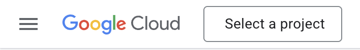
5. Type the project name (e.g. n8n-project), choose your trial billing account, then click the “Create” button.
   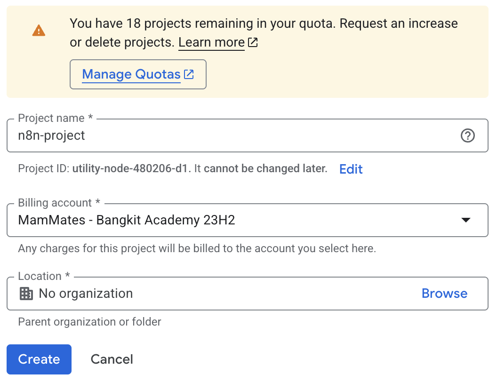
6. After the project is created, select your new created project from the project picker.

## 1st Section: Deploy the n8n on Cloud Run

We will use two approaches: **Cloud Console** and **Cloud Shell**. Choose one that fits you.

### Cloud Console

1. Search `cloud run` on the search bar, then choose `Cloud Run`.
   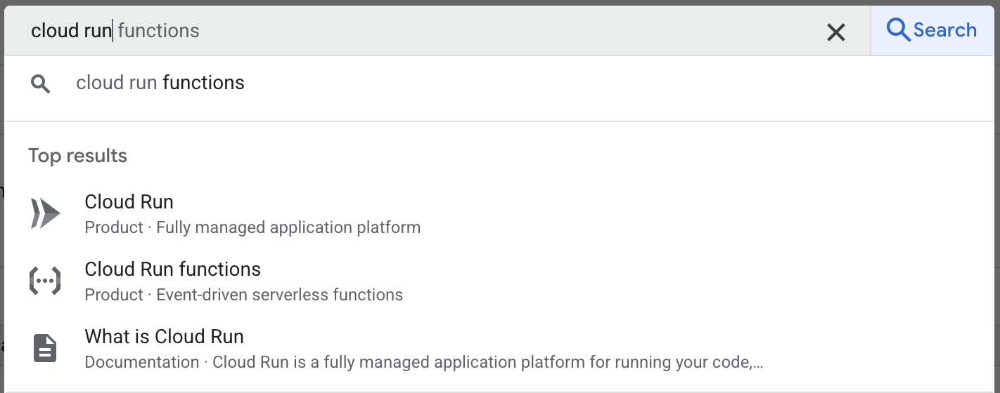
2. Enable the API if you are prompted to activate the Cloud Run API.
3. Click on `Deploy container` to start creating the n8n deployment.
4. Enter this following information:
   - choose `Deploy one revision from an existing container image`
   - fill `n8nio/n8n` on the container image URL
   - use `n8n-automation` as the service name
   - choose `us-west1` for the region
   - choose `Allow public access` on authentication section
   - change billing to `Instance-based`
   - on auto scaling, set 1 to the minimum number of instances and maximum number of instances
   - expand Containers, Volumes, Networking, Security section. Set `container port` to 5678 and `memory` to 2 GiB
5. Click `Create` to create first revision.

### Cloud Shell

1. Activate Cloud Shell by clicking on the Cloud Shell icon on the top right.
2. Authorize the access of Cloud Shell.
3. Enable the Cloud Run API (you can skip this, it will ask if you want this enabled when deployed).

   ```bash
   gcloud services enable run.googleapis.com
   ```

4. Deploy the first revision of n8n

   ```bash
   gcloud run deploy n8n-automation \
        --image=n8nio/n8n \
        --region=us-west1 \
        --allow-unauthenticated \
        --port=5678 \
        --no-cpu-throttling \
        --memory=2Gi \
        --min-instances=1 \
        --max-instances=1
   ```

## 1st Section: Create Revision to Update Webhook Cloud Console

### Cloud Console

1. Copy the URL of your deployed Cloud Run
2. Click on `Edit & deploy new version`
3. On edit containers, navigate to `Variables & Secrets`
4. Click `Add variable`
5. Use this value
   - Name: `WEBHOOK_URL`
   - Value: `the URL you copied before`
6. Click `Deploy` to create new revision

### Cloud Shell

1. Get details of the deployed Cloud Run service.

   ```bash
   gcloud run services describe n8n-automation --region=us-west1
   ```

2. Copy the URL by selecting the URL shown in the details.
3. Update the webhook URL.

   ```bash
   gcloud run services update n8n-automation \
        --region=us-west1 \
        --update-env-vars=WEBHOOK_URL=<the URL you copied before>
   ```

## 1st Section: Enable Google OAuth for n8n

### Enable Required APIs

1. Navigate to APIs Service > Library from the left sidebar.
2. Enable the following services by searching it one by one.
   - Google Drive API
   - Google Sheets API
     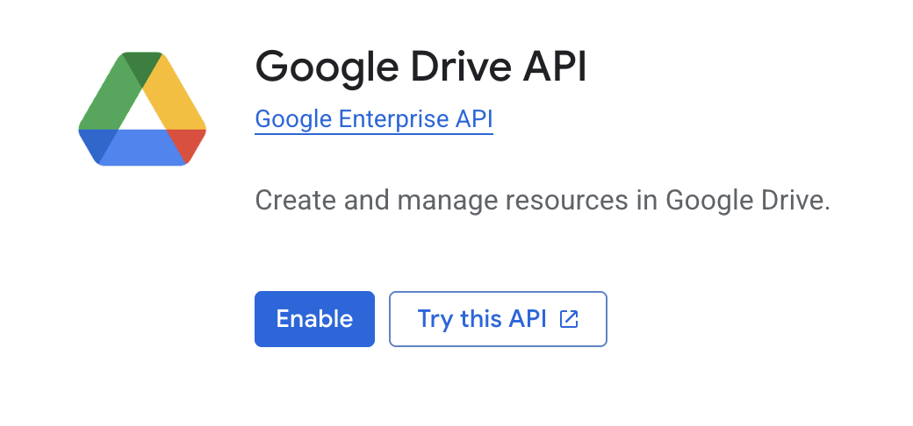
     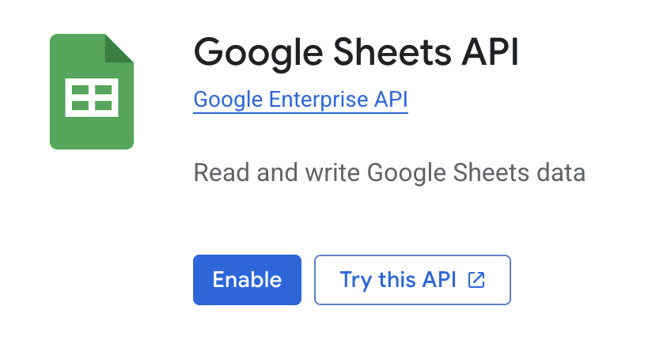

### OAuth Screen Setup

1. Navigate to APIs Service > OAuth consent screen from the left sidebar.
2. Select `Get started` on the Overview tab.
3. On App Information
   - App name: n8n Automation
   - User support email: <your email>
   - Click `Next`
4. On Audience, select External, then Next.
5. On Contact Information, enter your email address, then Next.
6. Read and accept Google's User Data Policy, then Continue.
7. Navigate to the Branding tab.
8. On Authorized domains, select “Add domain”
9. Enter the deployed n8n deployed on Cloud Run before (remove the https://).
10. Click Save to save the changes.
11. Navigate to the Audience tab.
12. Click `Publish app` to publish the OAuth.

### OAuth Client ID Setup

1. Navigate to APIs & Services > Credentials.
2. Select `Create credentials` then `OAuth client ID`.
3. Select `Web application` on Application type.
4. Change the name to `n8n Automation`.
5. On Authorized redirect URIs, select `Add URI`.
6. Add your Cloud Run deployment URL, append with `/rest/oauth2-credential/callback` (e.g. https://n8n.us-west1.run.app/rest/oauth2-credential/callback)
7. Click `Create`
8. Download JSON or copy the `Client ID` and `Client Secret` to be used on 2nd section

## 2nd Section: Create Telegram bot Using BotFather

1. Log in to your Telegram account, then search `@BotFather` or use this link instead [https://t.me/BotFather](https://t.me/BotFather).
2. Start the bot.
3. Create a new bot using `/newbot` command.
4. Choose a name for your new bot.
5. Choose an username for your bot. It must end with `bot` (e.g. expense_bot or ExpenseBot). If the username is already taken, choose the other name.
6. If your bot is created successfully, BotFather will give you the access token. It will be used for the next step.

<aside class="positive">
If you forgot or deleted the token, use the `/token` command and then select the bot you want to get the token for.
</aside>

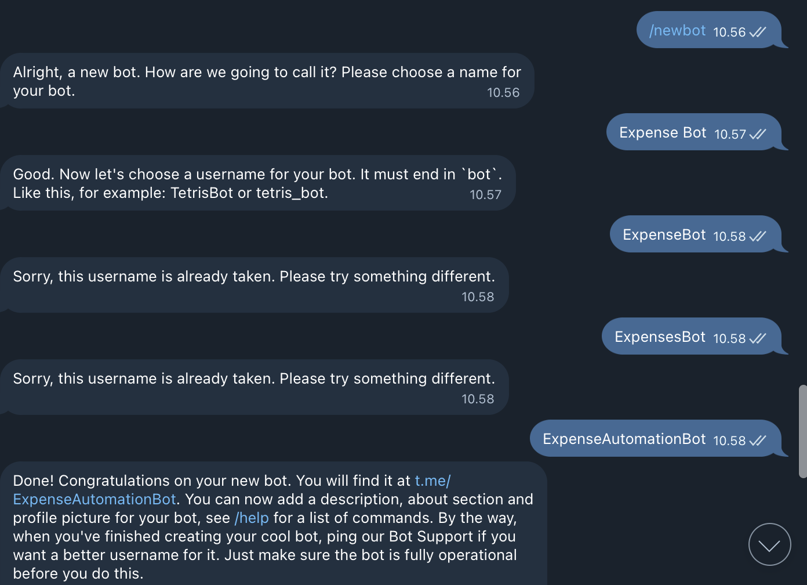

## 2nd Section: Create n8n Account on your self-deployed n8n

1. Access your deployed n8n.
2. Set up an owner account (you can add random info in this form).
   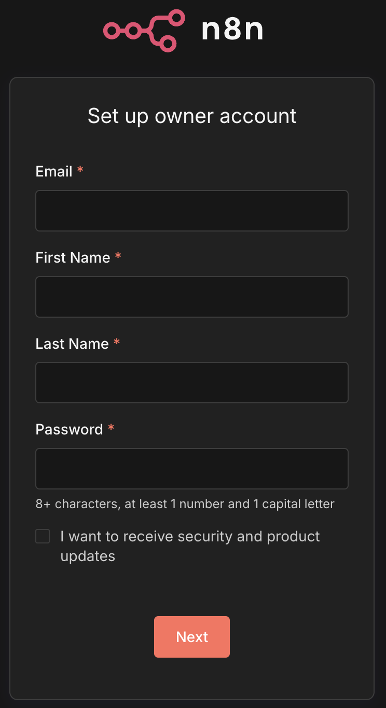
3. Select `I’m not using n8n for work` on `What best describes your company?` section.
4. Select `Event` on `How did you hear about n8n?` section.
5. Select `Get started`.
6. Skip the license offer.

## 2nd Section: Set up Telegram on n8n

1. On the left sidebar, click `+` then `Credentials`.
2. Select `Telegram API` on the app to connect.
3. Select `Continue`.
4. Paste the access token obtained from BotFather.
5. Click `Save` and wait for n8n to test the connection.
6. Close the Credentials modal.

## 2nd Section: Set up Google OAuth on n8n

1. On the left sidebar, click on `+` then `Credentials`.
2. Select `Google Sheets OAuth2 API` on the app to connect.
3. Select `Continue`.
4. Paste the `Client ID` and `Client Secret` obtained from 1st section.
5. Click on `Sign in With Google`.
6. Login with your Google account.
7. It’s okay to trust the login page because it’s created by yourself.
   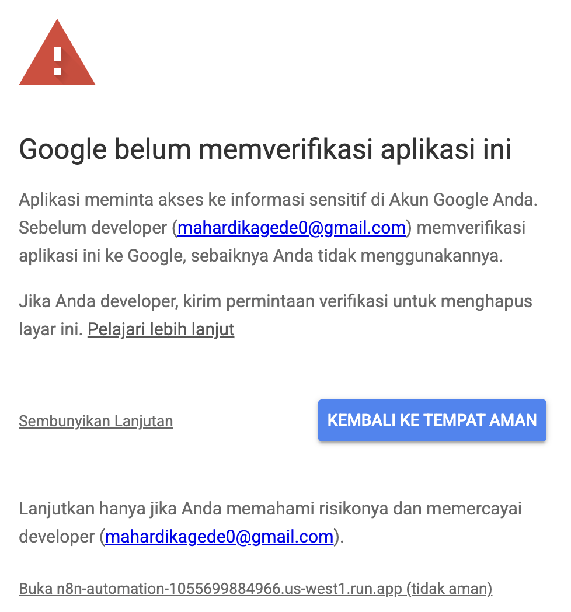
8. Select all permissions, then click `Continue`
   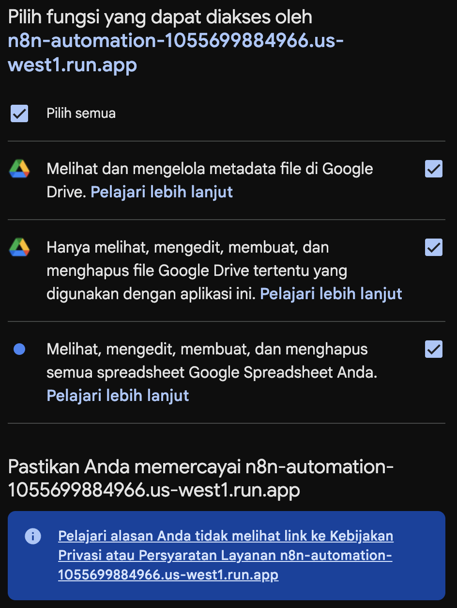
9. You will get this badge if the connection is successfully created.
   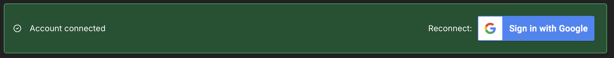
10. Close the Credentials modal.

## 2nd Section: Create Automation to Track Expenses

This section is quite long and have a little coding involved. Don't worry, I will guide you step by step.

### Creating Workflow

1. On the left sidebar, click on `+` then `Workflow`.
2. Change the workflow’s name to `Telegram Expenses`.

### Create Telegram Trigger Node

1. Create a Telegram trigger node by clicking the `+` button, then select `On message`.
2. Make sure to use the Telegram credential you created before.
3. Try `Execute step` then send a random message to the bot by accessing your bot.
4. After the message is sent, you will get the output on the right side.
5. Focus on the end of the output. `entities` field gives you additional bot command information if you send a message starting with `/`.

Message starting with `/`:  
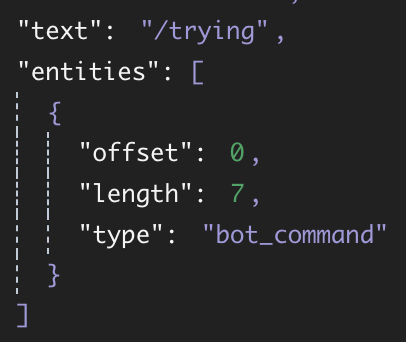

Normal message:  
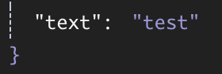

### Filter the Bot Command

1. Click on the `+` button on the right of the Telegram trigger node, then choose the `If` node.
2. Drag the `message.chat.entities.entities[0].type` from the left side to the `value1` column.
3. On the condition, choose `String > is equal to`.
4. Fill `value2` with `bot_command`.
5. Turn on the `convert types where required`.
6. Try to `Execute workflow`.

### Bot Reply If You Send A Non Bot Command

1. On the false output, click the `+` button then add Telegram > Send a text message node.
2. Drag `message.chat.id` from the left side to the `Chat ID` column.
3. On `Text`, fill with the rejection message, e.g. “Only bot commands were accepted.”
4. Try to `Execute workflow`.
   The Telegram bot will reply to your non bot command with your defined message.

### Different Actions Based On Bot Commands

1. On the true output, click the `+` button then add `Switch` node.
2. Drag `message.chat.text` to `value1`.
3. On the condition, choose `String > starts with`.
4. Fill `value2` with `/note`.
5. Activate `Rename Output` and rename to `/note`.
6. Turn on the `convert types where required`.
7. Close the node editor.
8. Try to `Execute workflow`.

### Transform the Expenses

1. On the output of /note, click the `+` button then add Code > Code in JavaScript.
2. Set the Mode to `Run Once for All Items`.
3. We split the command and list of expenses. Next, split the expenses into items and prices.
   ```javascript
   const rawMessage = $input.first().json.message.text.trim();
   const rawExpenses = rawMessage.split("/note\n")[1];
   const expenses = rawExpenses.split("\n");
   const output = expenses.map((expense) => {
     const e = expense.trim().split("/");
     let price = 0;
     if (e[1].endsWith("k")) {
       price = Number(e[1].split("k")[0].replaceAll(",", "."));
       price *= 1000;
     } else if (e[1].endsWith("rb")) {
       price = Number(e[1].split("rb")[0].replaceAll(",", "."));
       price *= 1000;
     } else {
       price = Number(e[1]);
     }
     return {
       item: e[0],
       price: price,
     };
   });
   return output;
   ```
4. Try to `Execute workflow`.
5. Then send this message
   ```
   /note
   ayam/10k
   sari roti/50k
   hydro coco/10000
   ```
6. Notice that the output is already split into a list of expenses.

### Insert into Spreadsheet

1. On the output of JavaScript code, click the `+` button then add Google Sheets > Append row in sheet.
2. Select your Google credential to connect with.
3. Create a new Spreadsheet on your Drive.
4. Type `Date`, `Month`, `Year`, `Item`, and `Price` as the table header.
5. Copy the Spreadsheet URL.
6. Back to n8n, On Document select `By URL` and paste your Spreadsheet’s URL.
7. On Sheet, select `From list`, and select your current sheet’s name.
8. On Mapping Column Mode, select `Map Each Column Manually`.
9. On Date, switch to Expression, then type `{{ $now.day }}`
10. On Month, switch to Expression, then type `{{ $now.month }}`
11. On Year, switch to Expression, then type `{{ $now.year }}`
12. Drag `item` from the left side (output of JavaScript node) into Item.
13. Drag `price` from the left side (output of JavaScript node) into Price.
14. Try to `Execute workflow`.

### Send Success Reply

1. On the true output, click the `+` button then add Telegram > Send a text message node.
2. Expand the Telegram trigger output on the left side.
3. Drag `message.chat.id` from the left side to the `Chat ID` column.
4. On `Text`, fill with the rejection message, e.g. “Your expenses are inserted into Sheet.”
5. Move to the `Settings` tab, turn `Execute Once` on.
6. Try to `Execute workflow`.
7. The Telegram bot will reply if your expenses are inserted into Sheet.

### Add New Rule to Summarize Expenses

1. Double click on the switch node.
2. Click on `Add Routing Rule`.
3. Copy and paste the value1 from `/note` section into value1 in new section.
4. On the condition, choose `String > starts with`.
5. Fill value2 with `/summary`.
6. Activate `Rename Output` and rename to `/summary`.
7. Turn on the `convert types where required`.
8. Close the node editor.

### Transform the Summary Command

1. On the output of /summary, click the `+` button then add Code > Code in JavaScript.
2. Set the Mode to Run Once for All Items`.
3. We split the command and the month-year summary.
   ```javascript
   const output = {
     month: $now.month,
     year: $now.year,
   };
   const rawMessage = $input.first().json.message.text.trim();
   const expression = rawMessage.split("/summary ");
   if (expression.length == 1) {
     return output;
   }
   const summaryExpressions = expression[1].split("-");
   switch (summaryExpressions.length) {
     case 2:
       output.year = summaryExpressions[1];
     case 1:
       output.month = summaryExpressions[0];
       break;
   }
   return output;
   ```
4. Try to `Execute workflow`.
5. Then send this message:
   `/summary` or `/summary 12` or `/summary 12-2025`
6. Notice that the output is splitted into object.

### Get Data From Spreadsheet

1. On the output of JavaScript code, click the `+` button then add Google Sheets > Get row(s) in sheet.
2. Select your Google credential to connect with.
3. On Document select `By URL` and paste your Spreadsheet’s URL.
4. On Sheet, select `From list`, and select your current sheet’s name.
5. Add the first filter, select Month column then drag month output from the left side to Value.
6. Add a second filter, select Year column then drag year output from the left side to Value.
7. Select `AND` as the Combine Filter.
8. Move to the `Settings` tab, turn `Always Output Data` on.
9. Try to `Execute step`.

### No Data Condition

1. On the output of the Spreadsheet, add the `If` node.
2. On `value1`, change the mode to Expression then use `{{ $json }}` as the value.
3. On condition, select `Object > is not empty`.
4. Try to `Execute step`.

### Send Empty Message

1. On the false output of the If node, add Telegram > Send a text message.
2. Expand the Telegram trigger output on the left side.
3. Drag `message.chat.id` from the left side to the `Chat ID` column.
4. On Text, change the mode to Expression.
   ```
   No data for {{ $('summary transformation').item.json.month }}/{{ $('summary transformation').item.json.year }}.
   ```
   <aside class="negative">
   Note: change `{{ $('summary transformation').item.json.month }}` and `{{ $('summary transformation').item.json.year }}` by drag and drop your summary transformation output from the left side to the Text field.
   </aside>
5. Try to `Execute workflow`.

### Create Summarization

1. On the true output of the If node, add the `Summarize` node.
2. On Aggregation, select `Count` then drag Item output from the left side to the Field column.
3. Add field, select `Sum` on Aggregation, then drag Price from the left side to the Field column.
4. Add field, select `Average` on Aggregation, then drag Price from the left side to the Field column.
5. Custom the field to get the summarize as you want.
6. Try to `Execute step`.

### Send Summarize

1. On the output of the Summarize, add Telegram > Send a text message.
2. Expand the Telegram trigger output on the left side.
3. Drag `message.chat.id` from the left side to the `Chat ID` column.
4. On Text, change the mode to Expression.
   ```
   This is your summary for {{ $('summary transformation').item.json.month }}/{{ $('summary transformation').item.json.year }}:
    - Item you buy: {{ $json.count_Item }}
    - Total expenses: {{ $json.sum_Price }}
    - Average expenses: {{ $json.average_Price }}
   ```
   <aside class="negative">
   Note: change `{{ $('summary transformation').item.json.month }}` and `{{ $('summary transformation').item.json.year }}` by drag and drop your summary transformation output from the left side to the Text field.
   </aside>
5. Try to `Execute workflow`.

### Test and Run the Workflow

1. Close the node editor.
2. Try to `Execute workflow`.
3. Try to send a message to insert expenses and get summarization.
4. To run the workflow, toggle the mode to `Active` on the top right.

### Export the Workflow

1. Select triple dots on the top right.
2. Select `Download`.
3. It will download the .json format of your workflow.

### The Final Workflow

After following the tutorials above, you should have this workflow.
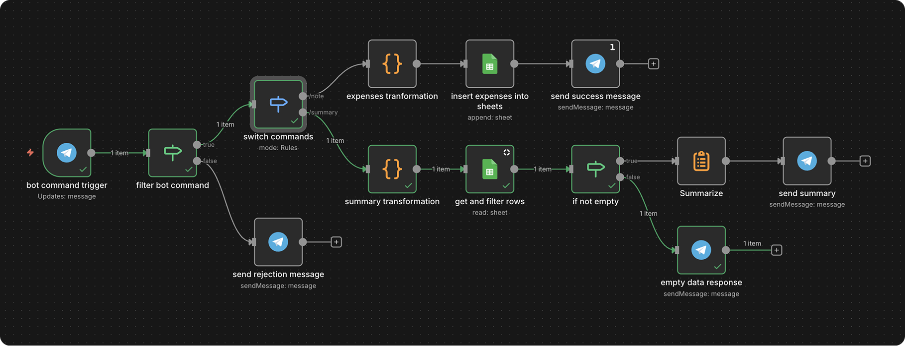

## References

1. [Google Cloud Run](https://cloud.google.com/run)
2. n8n Documentation
   - [Self-host in GCR](https://docs.n8n.io/hosting/installation/server-setups/google-cloud-run)
   - [Data structure](https://docs.n8n.io/courses/level-two/chapter-1)
   - [Google OAuth credential](https://docs.n8n.io/integrations/builtin/credentials/google/oauth-single-service)
   - [Telegram credential](https://docs.n8n.io/integrations/builtin/credentials/telegram)
